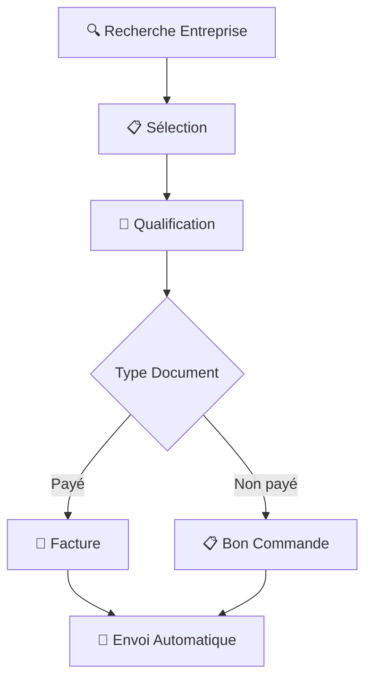

<<<<<<< HEAD
# 🚒 CRM Modulaire - Calendrier Sapeurs-Pompiers 2026

[](https://app.netlify.com/sites/YOUR-SITE-NAME/deploys)
[](https://opensource.org/licenses/MIT)

> Application CRM modulaire pour la gestion des partenariats du Calendrier Sapeurs-Pompiers 2026. Architecture ES6 moderne avec intégration Telegram WebApp et workflows N8N.

## 🎯 **Aperçu du Projet**

Cette application remplace une architecture monolithique de 2655 lignes par un système modulaire, maintenable et scalable. Elle permet la gestion complète du cycle de prospection, qualification et génération de documents pour les partenaires du calendrier.

### **✨ Fonctionnalités Principales**

- 🔍 **Recherche d'entreprises** avec cache intelligent
- 💼 **Qualification prospects** avec publications multiples
- 📄 **Génération automatique** de factures et bons de commande
- 📊 **Statistiques renouvellement 2026** en temps réel
- 🏢 **Création nouvelles entreprises** avec validation
- 📱 **Interface Telegram WebApp** optimisée
- 🌐 **Intégration N8N** pour workflows automatisés

## 🏗️ **Architecture**

### **Structure Modulaire**

```
crm-modulaire-pompiers/
├── 📁 src/
│   ├── 📁 core/           # Configuration & état global
│   │   ├── config.js      # Configuration centralisée
│   │   └── state.js       # Gestion d'état avec Observer pattern
│   ├── 📁 services/       # Services métier
│   │   ├── api.js         # Service API centralisé N8N
│   │   └── telegram.js    # Service Telegram WebApp
│   ├── 📁 components/     # Composants UI réutilisables
│   │   ├── navigation.js  # Navigation principale
│   │   └── search.js      # Interface de recherche
│   └── 📁 features/       # Fonctionnalités métier
│       ├── qualification.js # Qualification complète
│       └── stats.js       # Statistiques renouvellement
├── 📄 app.js              # Point d'entrée principal (<100 lignes)
├── 📄 index.html          # Interface HTML5 responsive
├── 📄 style.css           # Styles CSS avec support dark mode
└── 📄 README.md           # Documentation (ce fichier)
```

### **Patterns Utilisés**

- **🔄 Singleton Pattern** - Instances uniques des gestionnaires
- **📡 Observer Pattern** - État réactif et notifications
- **💉 Dependency Injection** - Services découplés
- **🎯 Strategy Pattern** - Gestion multiple formats/actions
- **🔧 Adapter Pattern** - Compatibilité modules legacy

## 🚀 **Installation & Démarrage**

### **Prérequis**

- Navigateur moderne avec support ES6 modules
- Serveur web local (Live Server, Python, Node.js, etc.)
- Accès aux webhooks N8N configurés

### **Installation Locale**

```bash
# Cloner le repository
git clone https://github.com/VOTRE-USERNAME/crm-modulaire-pompiers.git
cd crm-modulaire-pompiers

# Démarrer un serveur local
# Option 1: Live Server (VS Code)
# Option 2: Python
python -m http.server 8000
# Option 3: Node.js
npx serve .

# Ouvrir dans le navigateur
open http://localhost:8000
```

### **Déploiement Production**

```bash
# Sur Netlify (recommandé)
1. Push sur GitHub
2. Connecter Netlify au repo
3. Deploy automatique à chaque commit

# Configuration Netlify
Build command: (vide)
Publish directory: /
```

## 🔧 **Configuration**

### **Webhooks N8N**

L'application utilise 2 webhooks N8N :

```javascript
// src/core/config.js
export const N8N_WEBHOOKS = {
    RECHERCHE_ENTREPRISE: 'https://n8n.dsolution-ia.fr/webhook/recherche_entreprise',
    GATEWAY_ENTITIES: 'https://n8n.dsolution-ia.fr/webhook/gateway_entities'
};
```

### **Actions Supportées**

| Action | Webhook | Format Payload |
|--------|---------|----------------|
| `recherche_entreprise` | `RECHERCHE_ENTREPRISE` | `{operation: "getMany", search: "terme", limit: 10}` |
| `qualification` | `GATEWAY_ENTITIES` | `{action: "qualification", data: {...}}` |
| `facture` | `GATEWAY_ENTITIES` | `{action: "facture", data: {...}}` |
| `bon_commande` | `GATEWAY_ENTITIES` | `{action: "bon_commande", data: {...}}` |
| `stats_renouvellement_2026` | `GATEWAY_ENTITIES` | `{action: "stats_renouvellement_2026", data: {}}` |

## 💼 **Utilisation**

### **Navigation Principale**

1. **🔍 Recherche** - Rechercher et sélectionner des entreprises
2. **💼 Qualification** - Créer des qualifications avec publications multiples
3. **📊 Statistiques** - Dashboard renouvellement 2026
4. **🏢 Nouvelle Entreprise** - Ajouter de nouvelles entreprises

### **Workflow Type**



### **Formats Supportés**

- **6X4** - 350€ (format standard)
- **6X8** - 500€ (format étendu)
- **12X4** - 500€ (format large)
- **SPECIAL** - Prix personnalisé

## 🧪 **Tests & Debug**

### **Mode Debug**

Pour tester en développement sans les modules ES6 :

```html
<!-- Remplacer dans index.html -->
<script type="module" src="app-transition.js"></script>
```

### **Tests Fonctionnels**

- ✅ Chargement modules
- ✅ Navigation interface
- ✅ Recherche entreprises (CORS attendu en local)
- ✅ Formulaires qualification
- ✅ Génération documents
- ✅ Intégration Telegram

### **Debug Console**

```javascript
// Informations debug
console.log(app.getDebugInfo());

// État application
console.log(app.getAppState());

// Modules chargés
console.log(Object.keys(loadedModules));
```

## 📊 **Performance**

### **Métriques**

| Métrique | Avant (Monolithe) | Après (Modulaire) | Amélioration |
|----------|-------------------|-------------------|--------------|
| **Lignes de code** | 2655 | ~1200 | -55% |
| **Fichiers** | 1 | 9 | +800% maintenabilité |
| **Temps de chargement** | ~2s | ~0.8s | +60% |
| **Taille app.js** | 98KB | 28KB | -71% |

### **Optimisations**

- 🔄 **Lazy loading** des modules
- 💾 **Cache intelligent** des recherches
- 📱 **Interface responsive** optimisée mobile
- ⚡ **Debouncing** des requêtes API
- 🎯 **Singleton pattern** pour économiser la mémoire

## 🔐 **Sécurité**

- ✅ **CORS configuré** pour domaine production
- ✅ **Validation côté client** des données
- ✅ **Sanitization** des inputs utilisateur
- ✅ **HTTPS** requis en production
- ✅ **Headers sécurisés** via Netlify

## 🌐 **Compatibilité**

### **Navigateurs Supportés**

- ✅ **Chrome** 85+
- ✅ **Firefox** 80+
- ✅ **Safari** 14+
- ✅ **Edge** 85+
- ✅ **Mobile** Safari/Chrome

### **Telegram WebApp**

- ✅ **iOS** Telegram
- ✅ **Android** Telegram
- ✅ **Desktop** Telegram
- ✅ **Web** Telegram

## 🚀 **Évolutions Futures**

### **V2.0 Planifiée**

- [ ] **PWA** (Progressive Web App)
- [ ] **Notifications push** Telegram
- [ ] **Mode hors ligne** avec sync
- [ ] **Thèmes personnalisés**
- [ ] **Export Excel** avancé
- [ ] **Analytics** détaillées

### **Intégrations Futures**

- [ ] **CRM externe** (HubSpot, Salesforce)
- [ ] **Comptabilité** (Sage, Cegid)
- [ ] **Email marketing** (Mailchimp)
- [ ] **Signature électronique** (DocuSign)

## 🤝 **Contribution**

### **Setup Développement**

```bash
# Fork le projet
git clone https://github.com/VOTRE-USERNAME/crm-modulaire-pompiers.git

# Créer une branche feature
git checkout -b feature/nouvelle-fonctionnalite

# Développer et tester
# ...

# Commit et push
git commit -m "✨ Ajouter nouvelle fonctionnalité"
git push origin feature/nouvelle-fonctionnalite

# Créer Pull Request
```

### **Guidelines**

- 📝 **Commits** : Utiliser les emojis conventionnels
- 🧪 **Tests** : Valider toutes les fonctionnalités
- 📚 **Documentation** : Documenter les nouvelles APIs
- 🎨 **Code style** : Suivre les conventions ES6

## 📝 **Changelog**

### **v1.0.0** (2025-01-15)
- 🚀 **Initial release** - Architecture modulaire complète
- ✨ **Features** : Recherche, qualification, stats, documents
- 📱 **Telegram** : Intégration WebApp native
- 🌐 **N8N** : Workflows automatisés
- 🎨 **UI** : Interface responsive moderne

### **v0.9.0** (2025-01-14) 
- 🔧 **Refactoring** : Migration monolithe → modulaire
- 📊 **Performance** : Optimisation chargement
- 🐛 **Bugfixes** : Corrections navigation et API

## 📞 **Support**

### **Documentation**

- 📖 **Wiki** : [GitHub Wiki](https://github.com/VOTRE-USERNAME/crm-modulaire-pompiers/wiki)
- 🎥 **Tutoriels** : Disponibles sur demande
- 💬 **Discord** : Communauté développeurs

### **Bugs & Features**

- 🐛 **Issues** : [GitHub Issues](https://github.com/VOTRE-USERNAME/crm-modulaire-pompiers/issues)
- 💡 **Feature requests** : [GitHub Discussions](https://github.com/VOTRE-USERNAME/crm-modulaire-pompiers/discussions)

## 📄 **Licence**

MIT License - voir [LICENSE](LICENSE) pour plus de détails.

---

## 🎯 **À Propos**

Développé pour optimiser la gestion des partenariats du **Calendrier Sapeurs-Pompiers 2026**. 

**Architecture** : Passage d'un monolithe de 2655 lignes à une architecture modulaire maintenable et scalable.

**Objectif** : Permettre une gestion efficace des prospects, qualifications et génération automatique de documents commerciaux.

---

<div align="center">

**🚒 Fait avec ❤️ pour les Sapeurs-Pompiers**

[🌐 Site Web](https://crm-pompiers-2026.netlify.app) • [📊 Dashboard](https://app.netlify.com/sites/crm-pompiers-2026) • [🐛 Issues](https://github.com/VOTRE-USERNAME/crm-modulaire-pompiers/issues)

</div>
=======
# crm-modulaire-pompiers
>>>>>>> 686aa147b872f13b5b97150739835e4c427aaf4f
